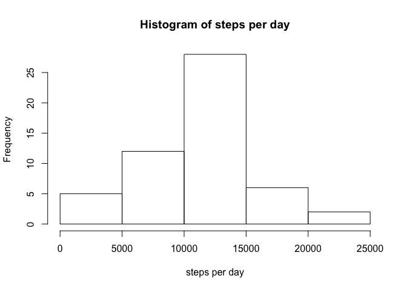
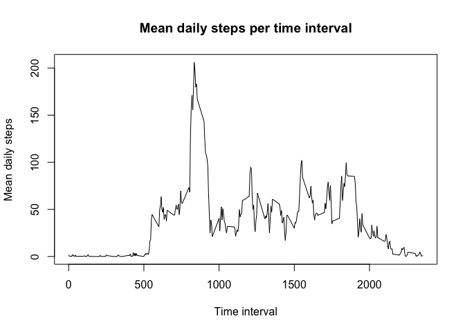
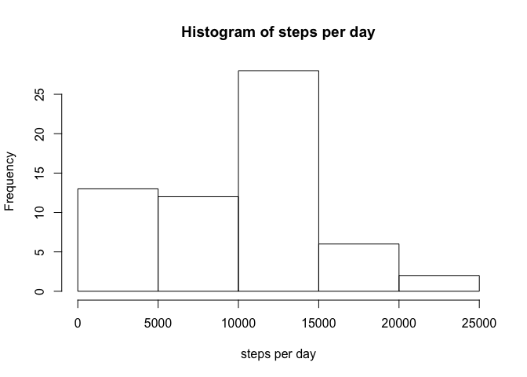
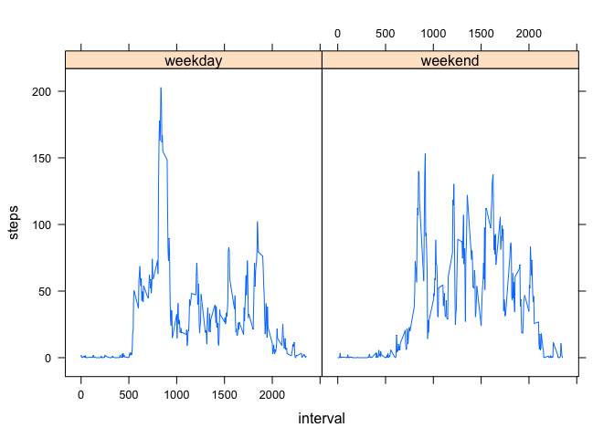

# Reproducible Research: Peer Assessment 1


## Loading and preprocessing the data


```r
unzip('activity.zip', 'activity.csv')
data <- read.csv('activity.csv')
```

## What is mean total number of steps taken per day?


```r
dailysteps <- tapply(data$steps, data$date, sum)
hist(dailysteps, main='Histogram of steps per day', xlab='steps per day')
```

 

```r
mean(dailysteps, na.rm=TRUE)
```

```
## [1] 10766.19
```

```r
median(dailysteps, na.rm=TRUE)
```

```
## [1] 10765
```

## What is the average daily activity pattern?


```r
intervalsteps <- tapply(data$steps, data$interval, mean, na.rm=TRUE)
plot(names(intervalsteps), intervalsteps, type='l',
     main='Mean daily steps per time interval',
     xlab='Time interval', ylab='Mean daily steps')
```

 

Which 5 minute interval, on average,  contains the maximum number of steps?


```r
names(intervalsteps)[which.max(intervalsteps)]
```

```
## [1] "835"
```

## Imputing missing values

How many values are missing?


```r
sum(is.na(data$steps))
```

```
## [1] 2304
```

We employ a simple strategy of imputing the daily mean for missing values.  For
days with no values, zero is used.


```r
meandailysteps <- tapply(data$steps, data$date, mean, na.rm=TRUE)
meandailysteps[is.nan(meandailysteps)] <- 0
narows <- is.na(data$steps)
rdata <- data
rdata[narows, 'steps'] = meandailysteps[data[narows, 'date']]
```

Now we examine the daily total steps for the adjusted data for comparison with
the original data.


```r
rdailysteps <- tapply(rdata$steps, rdata$date, sum)
hist(rdailysteps, main='Histogram of steps per day', xlab='steps per day')
```

 

```r
mean(rdailysteps, na.rm=TRUE)
```

```
## [1] 9354.23
```

```r
median(rdailysteps, na.rm=TRUE)
```

```
## [1] 10395
```

```r
mean(rdailysteps, na.rm=TRUE) - mean(dailysteps, na.rm=TRUE)
```

```
## [1] -1411.959
```

```r
median(rdailysteps, na.rm=TRUE) - median(dailysteps, na.rm=TRUE)
```

```
## [1] -370
```

Our scheme appears to create more values on the lower end of the distribution,
but the shape of the distribution is largely unaffected otherwise.

## Are there differences in activity patterns between weekdays and weekends?


```r
rdata$date <- as.Date(rdata$date, format='%Y-%m-%d')
rdata$weekday <- factor(weekdays(rdata$date) %in% c('Saturday', 'Sunday'),
                        levels=c(FALSE, TRUE), labels=c('weekday', 'weekend'))
stepsbyintervalweekday <-
    aggregate(steps ~ interval + weekday, data=rdata, mean)
library(lattice)
xyplot(steps ~ interval | weekday, data=stepsbyintervalweekday, type='l')
```

 
